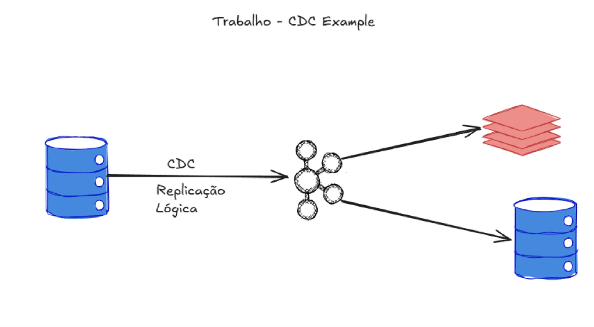

### Trabalho: Pipeline CDC fim a fim

#### Objetivo
- **Construir um pipeline reprodutível** de replicação de dados com CDC.

#### Fluxo de alto nível
- **Fonte (RDBMS) com Replicação Lógica** → **Debezium ou Airbyte** → **Kafka** (tópicos + Schema Registry) → distribuição para **pelo menos 2 destinos**.
- Destinos exemplos: **Postgres**, **MinIO/S3** (Parquet/Delta), **DuckDB** local. (Transformações com **Spark** são opcionais.)

#### Ferramentas sugeridas
- **Kafka**, **Debezium/Airbyte**, **DuckDB**, **Postgres**, **MinIO**.

#### Entrega e avaliação
- Pipeline deve ser **reprodutível** (ex.: `docker-compose` + configs).
- **PR** para o repositório da disciplina.
- Demonstrar captura de **INSERT/UPDATE/DELETE** no banco fonte chegando a **≥ 2 destinos**.
- Evidências de execução (consultas SQL, prints ou verificações automáticas).

#### Checklist mínimo
- `docker-compose.yml` com Kafka (+ Schema Registry), Debezium/Airbyte e destinos.
- Tópicos no Kafka e **PConsumidores/Produtores configurados** 
- Scripts de **carga inicial** e de **mutações** na tabela de origem.
- Instruções passo a passo para **subir, popular e validar** o pipeline.
- Consultas/queries de **validação** nos destinos.

#### Estrutura sugerida do diretório
- `docker-compose.yml`
- `connectors/` (configs `.json` dos conectores)
- `scripts/` (carga e mutações)
- `README.md` (como executar)
- `docs/` (arquitetura e prints, opcional)

#### Observações
- Use nomes claros para **tópicos** e **conectores**.

